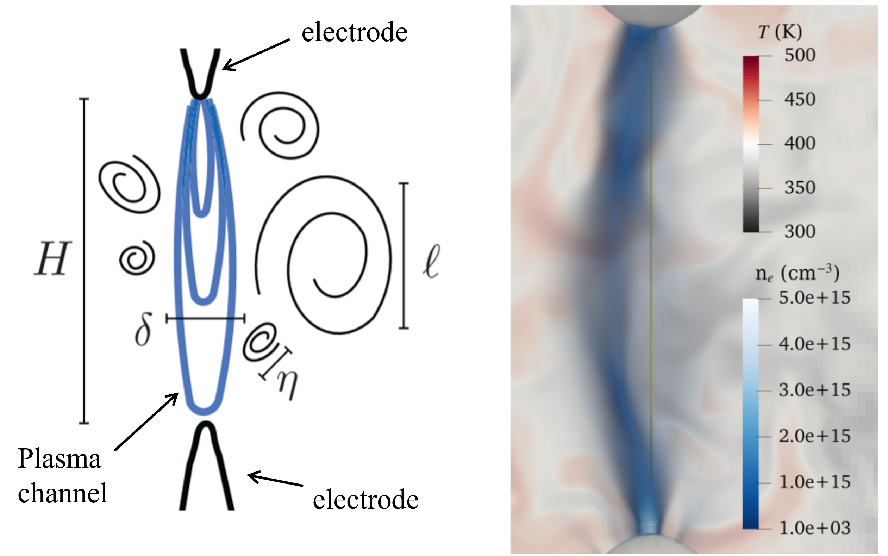
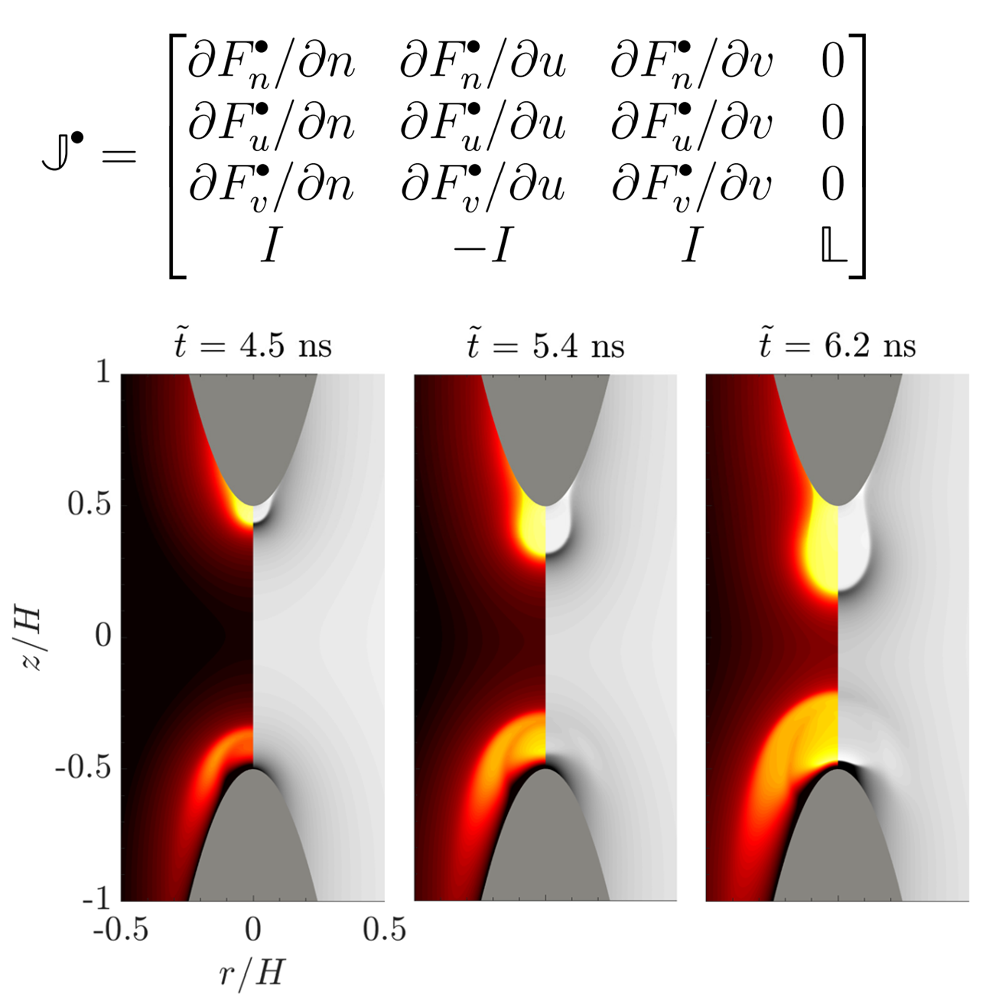
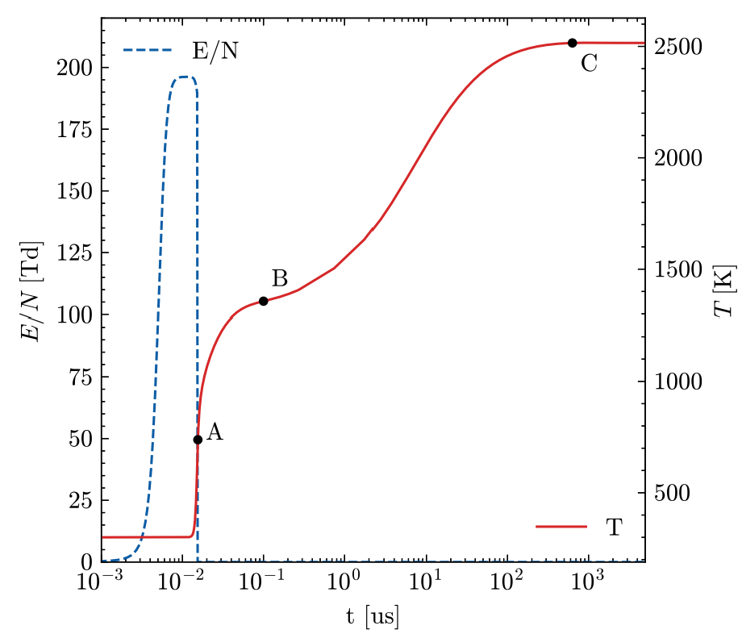

# Alfredo Duarte Gomez

## Bio
I am a computational scientist that specializes in the use of Computational Fluid Dynamics (CFD) to solve multi-physics problems. I recently completed my PhD at the Department of Aerospace Engineering and Engineering Mechanics at the University of Texas at Austin. I have experience in the use, development, and validation of open-source codes in fluid dynamics, and I also possess a strong background in the analysis and curation of large datasets. I am especially interested in the intersection of High-Performance Computing (HPC) and its application towards engineering systems.

- **LinkedIn**: [www.linkedin.com/in/alfredo-duarte-33806012b/](https://www.linkedin.com/in/alfredo-duarte-33806012b/)

## Education 
- **Ph.D.**, Aerospace Engineering, [University of Texas at Austin](https://www.ae.utexas.edu/research/aerothermodynamics-and-fluid-mechanics), December 2024 
- **B.S.**, Aerospace Engineering _Cum Laude_, [University of Notre Dame, Indiana](https://ame.nd.edu/), May 2019

## Research and Work Experience
- **Graduate Researcher** - [University of Texas at Austin](https://www.ae.utexas.edu/research/aerothermodynamics-and-fluid-mechanics), August 2019 - December 2024
  -  Development and application of computational modeling techniques to multi-physics/multi-scale problems in fluid mechanics (Advisor: Prof. Fabrizio Bisetti, [Reactive Flow Modeling Lab](https://sites.utexas.edu/flow/)).
    
- **Intern** - [National Renewable Energy Laboratory](https://www.nrel.gov/), January 2023 - June 2023
  - Contributed to the extension and validation of low-temperature plasma capabilities of the [PeleC](https://www.exascaleproject.org/combustion-pele-a-new-exascale-capability-for-improving-engine-design/) solver at the High-Performance Algorithms and Complex Fluids Group.

## Projects 

### Massively Parallel Simulations of Plasma Assisted Combustion
It is speculated that plasma discharges can be used to ignite very lean reactive mixtures, which may increase the energy efficiency and lower pollutants in combustion devices such as aircraft engines, gas turbines for power generation, and scramjets for high-speed flight. The numerical study of such configurations will require a new generation of solvers to deal with the large problem size, the range of spatial and temporal scales involved, and the complex chemical kinetics mechanisms. As part of this project, we developed a unique exascale parallel software based on the Adaptive Mesh Refinement library [AMReX](https://www.exascaleproject.org/highlight/amrex-a-performance-portable-framework-for-block-structured-adaptive-mesh-refinement-applications/) in collaboration with research personnel at the National Renewable Energy Laboratory. We successfully executed simulations of three-dimensional plasma discharges and the ignition of air/fuel mixtures in pin-to-pin electrode configurations using high-fidelity models. Learn more here: [1](https://doi.org/10.2514/6.2024-1820), [2](https://doi.org/10.2514/6.2023-2385).

- Skills: Computational Fluid Dynamics (CFD), C/C++, Kokkos (GPU programming), Python, Data visualization.

### Implementing Advanced Implicit Algorithms
The need to solve nonlinear systems of Partial Differential Equations (PDEs) is ubiquitous in engineering and fluid dynamics. In many cases, it is advantageous to use implicit methods to overcome time step limitations imposed by the physics of the problem. However, for large multiphysics problems with strong coupling, this requires the very expensive formation and factorization of large Jacobian matrices. The use of advanced implicit algorithms such as the Jacobian-free Newton Krylov (JFNK) method with an appropriate preconditioner has proved very successful in overcoming these limitations. In this project, we developed a fully implicit parallel solver for low-temperature plasma discharges that utilizes a novel preconditioning framework. The solver was built using the [PETSc](https://petsc.org/release/) toolkit and was successful in overcoming all limiting time scales and reducing simulation costs by a factor of 10, while maintaining excellent parallel efficiency (greater than 75%) with up to thousands of processors. [Learn more](https://doi.org/10.1016/j.jcp.2023.112007).

- Skills: C/C++, Parallel Computing (MPI, GPU), MATLAB, Version control (git), Linear Algebra.

### Developing Plasma Kinetics Mechanisms for Combustion Applications 
Plasma discharges have been suggested as a promising technique to improve combustion stability, owing to its capability to produce new active species and modifying the oxidation pathways of fuels considerably. This has required the reexamination of traditional chemical kinetics mechanisms, requiring considerable efforts in the development and validation of new plasma kinetics mechanisms. Moreover, for multi-dimensional simulations, new techniques are required to reduce the size of these novel mechanisms. In this project, we developed new plasma mechanisms for the ignition of fuels such as ethylene, methane, and iso-octane. Additionally, we developed novel approaches to reduce the size of these mechanisms using advanced techniques such as graph-based methods and machine learning. [Learn more](https://doi.org/10.1016/j.combustflame.2023.113252).

- Skills: CHEMKIN, Data analysis, Jupyter, Python, Machine learning.

### High-Performance Computing
The use of numerical techniques to solve relevant problems in engineering requires vast computational resources. As a computiational scientist, I have experience building, developing, and deploying scientific software in High Performance Computing (HPC) systems. My expertise includes running scientific applications and data analysis on some of the fastest supercomputers in the world, including the systems at the Texas Advanced Computing Center ([TACC](https://tacc.utexas.edu/)) and the [NREL Computational Science Center](https://www.nrel.gov/computational-science/hpc-user-facility.html). I have also participated in the prestigious Argonne Training Program on Extreme-Scale Computing ([ATPESC](https://extremecomputingtraining.anl.gov/about-atpesc/)), a course on the key skills and tools to execute computational science on current and future leadership-class computing systems.
- Skills: Linux/Unix, Slurm, C/C++, Fortran, Profiling, Optimization, Parallel Computing (MPI, GPU).

    
## Selected Publications 
- Duarte Gomez, A., Deak, N., Esclapez, L., Day, M. Bisetti, F., _High-fidelity mathematical models and efficient numerical methods for the simulation of ignition of reactive mixtures by nanosecond low-temperature plasma discharges in realistic configurations_, Combustion Theory and Modelling, (under review 2025).

- Rekkas-Ventiris, G., Duarte Gomez, A., Deak, N., Kincaid, N., P., Bisetti, F., Bellemans, A., [_A novel machine learning based lumping approach for the reduction of large kinetic mechanisms for plasma-assisted combustion applications_](https://doi.org/10.1016/j.combustflame.2023.113252), Volume 260, 2024, 113252, ISSN 0010-2180.

- Duarte Gomez, A., Deak, N., Bisetti, F., [_Jacobian-free Newton-Krylov method for the simulation of non-thermal plasma discharges with high-order time integration and physicsbased preconditioning_](https://doi.org/10.1016/j.jcp.2023.112007), Volume 480, 2023, 112007, ISSN 0021-9991.

## Selected Presentations
- Duarte, A., Deak, N., Bisetti, F., Jan. 2024 _Verification and Validation of a fully-coupled three-dimensional low-temperature plasma and reactive Navier Stokes solver_, presented at AIAA SciTech 2024, Orlando, FL.

- Duarte, A., Deak, N., Bisetti, F., Nov. 2023 _Direct Numerical Simulation of expansion, hydrodynamic mixing, and heat transfer to electrodes during low-temperature plasma discharges in atmospheric air_, presented at the 76th Annual Meeting of the Division of Fluid Dynamics, Washington, DC.

- Duarte, A., Deak, N., Bisetti, F., Feb. 2023 _Jacobian-free implicit algorithms for the simulation of low-temperature plasma discharges_ presented at the National Renewable Energy Laboratory (NREL) Hybrid Seminar, Golden, CO.

- Duarte, A., Deak, N., Bisetti, F., Oct. 2022 _Efficient preconditioning for the simulation of nanosecond discharges using Jacobian-free Newton Krylov methods_ presented at Gaseous Electronics Conference, Sendai, Japan.

- Duarte, A., Deak, N., Bisetti, F., Jun. 2022 _Preconditioning framework for nanosecond discharges using Jacobian Free Newton Krylov Methods_ presented at International Workshop on Plasma Assisted Combustion, Paris, France.
